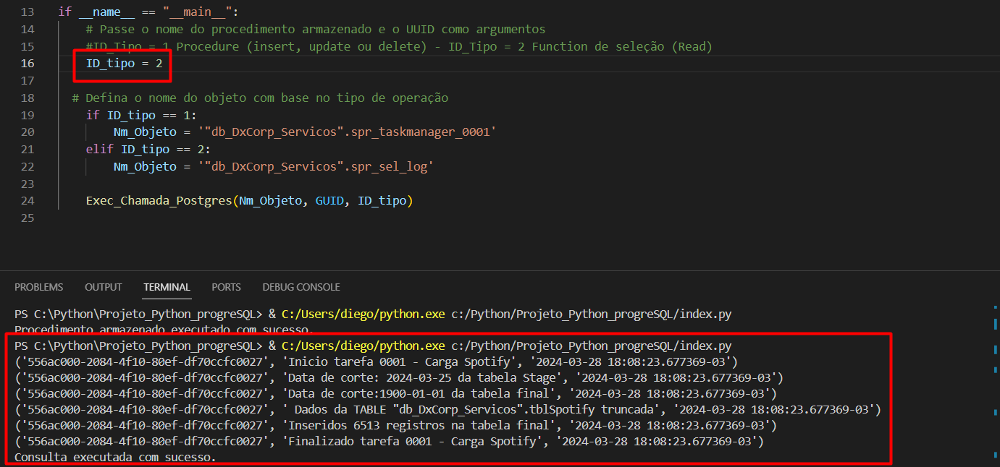

# Manipulando objetos PostgreSQL com Python


## Instalação das Dependências

Para executar este script Python, você precisa instalar algumas bibliotecas. Use o `pip`, o gerenciador de pacotes padrão do Python.

```sh
pip install psycopg2 python-dotenv
```

Certifique-se de ter permissões adequadas para instalar pacotes Python no seu ambiente.

O arquivo `.env` contém a string de conexão com o PostgreSQL.

Dependendo da operação que deseja realizar, você pode usar duas opções:
1. **Procedure (insert, update ou delete):** Defina `ID_tipo` como 1.
2. **Function de seleção (Read):** Defina `ID_tipo` como 2.

Certifique-se de definir corretamente `ID_tipo` no seu script de acordo com a operação desejada.

Execução ID_tipo = 1  (Procedure)


Execução ID_tipo = 1 (Function de seleção)


## Contribuição

Este projeto está aberto para contribuições e melhorias. Se você tiver alguma sugestão ou desejar ajudar, fique à vontade para fazer um fork do repositório, fazer suas alterações e enviar uma solicitação de pull. Estamos ansiosos para colaborar com você!